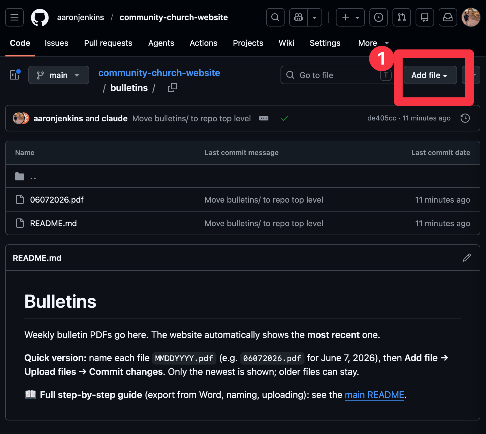
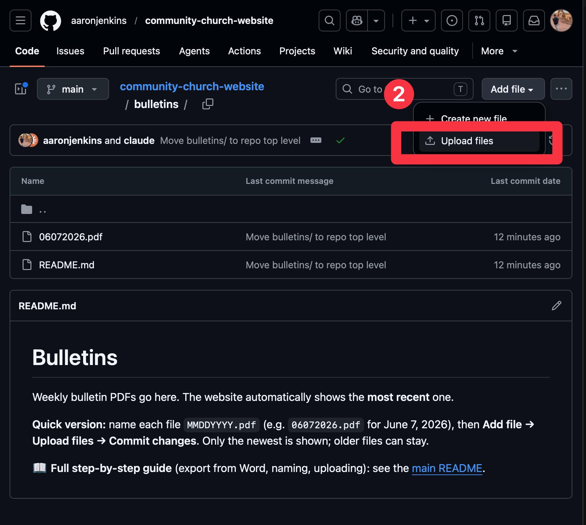
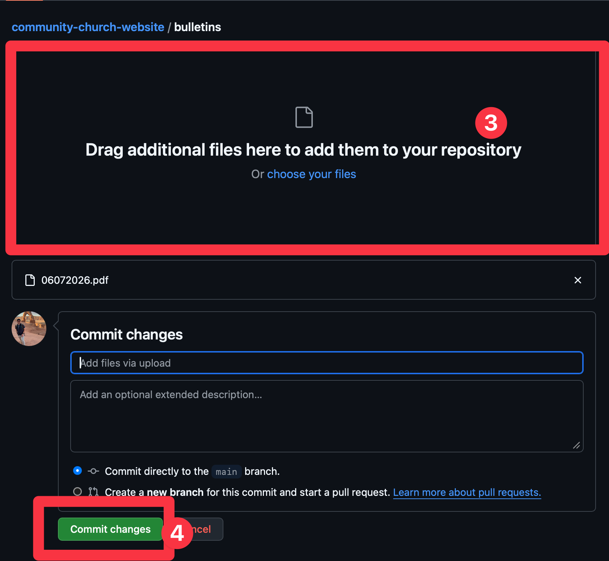

# How to Post the Weekly Bulletin

A step-by-step guide to putting the weekly bulletin on the church website. You'll do three things each week:

1. Save your Word document as a PDF.
2. Name the PDF with the date.
3. Upload it to the website.

The website automatically shows the newest bulletin — you don't have to touch anything else.

---

## Before your first time (one-time setup)

You need a **free GitHub account**, and you need to be invited to the church website. Aaron will send you an invitation by email — click the link in it and accept. Once that's done, you won't have to do it again.

- Don't have a GitHub account yet? Go to **github.com**, click **Sign up**, and follow the prompts. It's free.

---

## Step 1 — Save your bulletin as a PDF

You'll make a PDF copy of your Word document. (Your original Word file stays exactly as it is — this just makes a second copy in PDF form.)

**On Windows:**

1. Open the bulletin in Microsoft Word.
2. Click **File** (top-left), then **Save As**.
3. Choose where to save it — **Desktop** is easiest to find later.
4. Just below the file name box, there's a dropdown that says **Word Document** or **Save as type**. Click it and choose **PDF**.
5. Click **Save**.

**On a Mac:**

1. Open the bulletin in Microsoft Word.
2. Click **File** (top menu bar), then **Save As** (or **Export**).
3. Choose **Desktop** as the location.
4. Find the **File Format** dropdown and choose **PDF**.
5. Click **Save** (or **Export**).

You now have a PDF of the bulletin on your Desktop.

---

## Step 2 — Name the PDF with the date

The website figures out which bulletin is newest from the file's name, so the name has to follow one exact pattern:

> **Two-digit month, two-digit day, four-digit year — all run together, ending in `.pdf`**
>
> **`MMDDYYYY.pdf`**

**Example:** the bulletin for **June 7, 2026** is named:

> `06072026.pdf`

A few more examples so the pattern is clear:

| Bulletin date      | File name      |
| ------------------ | -------------- |
| June 7, 2026       | `06072026.pdf` |
| July 12, 2026      | `07122026.pdf` |
| December 25, 2026  | `12252026.pdf` |
| January 4, 2027    | `01042027.pdf` |

Notes:
- Always use **two digits** for the month and day — January is `01`, the 4th is `04`.
- **No spaces, no dashes, no words** — just the eight numbers and `.pdf`.

**To rename the file:** on your Desktop, right-click the PDF, choose **Rename**, type the correct name, and press Enter.

---

## Step 3 — Upload it to the website

1. Open the bulletins folder in your web browser (sign in to GitHub if it asks):
   **[github.com/aaronjenkins/community-church-website/tree/main/bulletins](https://github.com/aaronjenkins/community-church-website/tree/main/bulletins)**

2. Click the **Add file** button near the top-right.

   

3. Choose **Upload files** from the menu that appears.

   

4. Drag your renamed PDF into the box on the page — or click **choose your files** and pick it from your Desktop. Then scroll down and click the green **Commit changes** button.

   

That's everything. Within a minute or two the website updates on its own, and your new bulletin shows up on the **Bulletins** tab. Refresh the page if you don't see it right away.

---

## If something doesn't look right

- **The new bulletin isn't showing up.** Double-check the file name is exactly `MMDDYYYY.pdf` with the right date (Step 2). A wrong name is the usual cause. Also give it a couple of minutes — the site takes a moment to update.
- **It still shows last week's bulletin.** Make sure this week's date is *later* than the others. The site always shows the newest date.
- **You don't need to delete old bulletins.** They can stay in the folder; only the newest one is shown.

---

## Changing the website's wording

All the text on the site — the church name, service times, address, the About
paragraph, event list, VBS details, button labels, and so on — lives in one
file: **`content.json`** at the top of the repository.

To change wording:

1. Open **[content.json](https://github.com/aaronjenkins/community-church-website/blob/main/content.json)** on GitHub.
2. Click the **pencil icon** (Edit) in the top-right.
3. Change the text **inside the quotation marks** only — don't remove the quotes,
   commas, or curly braces around them.
4. Scroll down and click **Commit changes**. The site updates in a minute or two.

> Tip: only edit what's between the `"quotes"`. For example, change
> `"tagline": "Join us every Sunday at 10:00 AM"` to
> `"tagline": "Join us every Sunday at 9:30 AM"`. If a change ever breaks the
> page, undo it by editing the file back, or ask Aaron.

## For the developer

This is a React 19 + Vite 8 single-page app deployed to GitHub Pages (auto-deploy on push to `main`). Live at https://aaronjenkins.github.io/community-church-website/.

- One-time: invite the bulletin editor as a **collaborator** (Settings → Collaborators) so their upload works.
- All site copy lives in the top-level `content.json`; `src/config.js` is a thin loader (`import content from "../content.json"`) and every component reads strings from it. Add a string to `content.json` + reference `config.*` in the component — no hardcoded user-facing text in components.
- `src/components/Bulletins.jsx` uses `import.meta.glob('/bulletins/*.pdf', { eager: true, query: '?url', import: 'default' })` — Vite enumerates + fingerprints the PDFs at build time, so a new upload is picked up by the Pages build automatically with no config edit. Sort: filename `MMDDYYYY` → `Date`, newest first.
- Local dev: `npm install`, then `npm run dev` (dev server), `npm run build` (production build), `npm run lint`.
